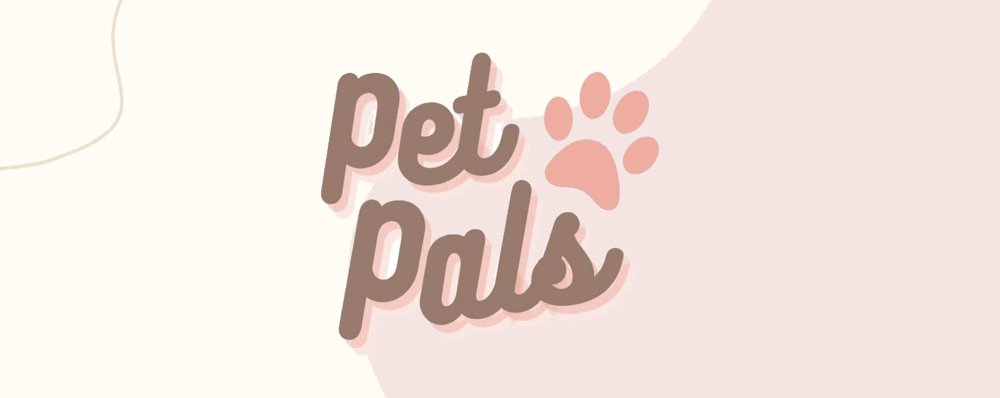

## Table of Contents
1. [About](#about)

2. [Getting Started](#getting-started)
   * Installation
   * Run

3. [Login Details (for testing purpose)](#login)

## <a name="about"></a>About
PetPals is a fully responsive website that helps to match pet owners and pet service providers in Singapore. The site is built using Vuejs and deployed via Vercel.
```diff
https://g3t4petpals.vercel.app/
```

## <a name="getting-started"></a>Getting Started

### Installation
1. *Clone the repository*
> $ git clone https://github.com/vickyyqu/petpals.git

2. *Navigate to repository directory*
> $ cd petpals/g3t4-petpals
```diff
- Note: All the codes are in petpals/g3t4-petpals directory
```
3. *Install dependencies*
> $ npm install

### Run
1. *Compiles and hot-reloads for development*
> $ npm run dev

## <a name="login"></a>Login Details (for testing purpose)
### Pet Owner 
Email: weiqi.qu.2021@smu.edu.sg
<br>
Password: vicky123

### Pet Service Provider
Email: iris.liew.2021@smu.edu.sg
<br>
Password: iris123

### Register with Your Own Email

```diff
Verify your email first before logging in.
```
```diff
Check your spam folder if the verification email is not in your inbox.
```


